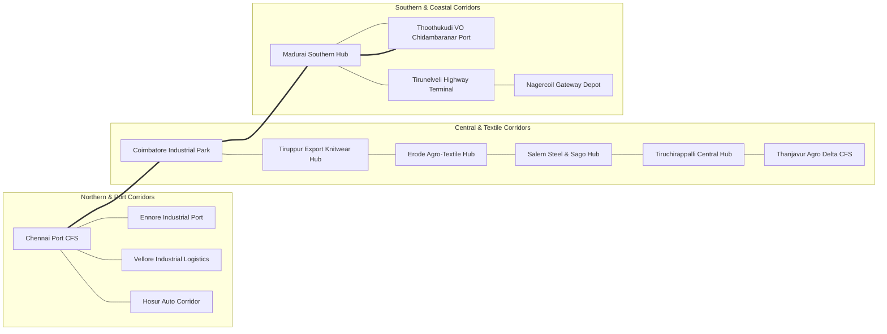

# 🚚 QUANTUM EXPRESS
### *Enterprise B2B Heavy Freight & State Logistics Hub Corridor Network*

[](http://localhost:3000)
[](https://nextjs.org/)
[](https://spring.io/)
[](https://fastapi.tiangolo.com/)
[](LICENSE)

---

## 🌐 Executive Vision & Strategy

> *"By mapping the major industrial cities, seaports, manufacturing corridors, and state logistics centers across Tamil Nadu, Quantum Express establishes a high-throughput B2B freight fulfillment network. It connects shippers, state warehousing facilities, and commercial heavy truck fleets with real-time dispatch intelligence."*

Tamil Nadu serves as one of India's leading industrial manufacturing, textile, automotive, and export powerhouses. **Quantum Express** bridges the operational gap between manufacturers, state warehousing depots, commercial truck operators, and seaports through an enterprise multi-portal logistics ecosystem.

---

## 🗺️ Key Logistics Hubs & Industrial Corridors

Quantum Express connects the top key commercial hubs and state logistics centers across Tamil Nadu:



### 📍 Strategic Hub Directory

| # | City / Logistics Terminal | RTO Code | Primary Industrial Specialization |
| :--- | :--- | :---: | :--- |
| **1** | **Chennai Port Container CFS** | `TN-01` | International Maritime Export / Heavy Machinery |
| **2** | **Ennore Port & Petrochemical Terminal** | `TN-04` | Bulk Freight, Minerals & Port Logistics |
| **3** | **Coimbatore Industrial Logistics Park** | `TN-38` | Heavy Engineering, Pumps, Textile Spindles |
| **4** | **Madurai Southern Logistics Hub** | `TN-58` | Southern Distribution, FMCG, Agro Commodities |
| **5** | **Tiruchirappalli Central Freight Hub** | `TN-45` | Boiler Fabrication, Central Transit Hub |
| **6** | **Salem Steel & Sago Logistics Center** | `TN-27` | Heavy Metals, Steel & Processing Freight |
| **7** | **Tiruppur Export Knitwear Terminal** | `TN-39` | Global Garments & Textile Export Containers |
| **8** | **Erode Agro-Textile Warehousing CFS** | `TN-33` | Turmeric, Textiles & Multi-Modal Storage |
| **9** | **Thoothukudi (VOC Port CFS)** | `TN-69` | International Sea Freight, Salt & Seafood Exports |
| **10** | **Hosur SIPCOT Automobile Terminal** | `TN-70` | Automotive Components, EV Manufacturing & Tech |
| **11** | **Vellore Industrial Logistics Depot** | `TN-23` | Leather Export, Precision Industrial Goods |
| **12** | **Tirunelveli Multi-Modal Cargo Terminal**| `TN-72` | Wind Energy, Minerals & Southern Transit |
| **13** | **Thanjavur Delta Agro-Logistics Center** | `TN-49` | Grain Reserves, Agro Cold-Storage & Foods |
| **14** | **Nagercoil Gateway Logistics Depot** | `TN-74` | Southern Peninsula Distribution & Marine Freight |

---

## 🏢 Platform Features & User Portals

Quantum Express provides dedicated, isolated workflows for every participant in the freight lifecycle:

### 1. 🗼 Dispatcher Control Tower (`/admin`)
- **Live Interactive Highway Map**: Real-time visualization of freight corridors using **OpenStreetMap (OSM)** turn-by-turn road networks.
- **Directional Route Lines**: Instant visual distinction between forward and return routes (e.g. Coimbatore $\rightarrow$ Madurai *light coral*, Madurai $\rightarrow$ Coimbatore *dark maroon*).
- **Interactive Corridor Telemetry**: Click any highway route line for 2-line road analytics: odometer distance, transit duration, driver handle, and manifest state.
- **Smart AI Truck Assignment**: Evaluates truck proximity, driver reliability, rating, and vehicle suitability to dispatch the optimal source terminal driver.
- **Quotation Generator**: Itemizes base freight, warehouse storage fees, handling surcharges, and statutory 18% GST.

### 2. 📦 B2B Shipper & Consignment Portal (`/customer`)
- **Unique Business Code Isolation**: Each corporate shipper logs in with their unique code (e.g., `ABC123`, `KVI101`, `CHE001`), ensuring **100% isolation of bills, quotations, and cargo manifests**.
- **Heavy Freight & Warehouse Storage Booking**: Seamlessly book 14ft, 20ft, 32ft, 40ft, or Refrigerated Reefer transport alongside climate-controlled warehouse pallet storage.
- **Real-Time Quotation Presenter**: Review official dispatcher quotations and accept or reject with a single click.
- **Active Trip Tracking**: Monitor live truck movement along the highway with accurate destination ETAs.

### 3. 🚚 Commercial Truck Portal (`/driver`)
- **Station-Assigned Driver Fleet**: Standardized driver profiles (`TN-XX-1001`, `TN-XX-1002`, etc.) with unique 4-digit truck identifiers and localized addresses at every state terminal.
- **Instant Dispatch Load Offers**: Receive "Goods Ready to Dispatch" offers transmitted directly from the source hub.
- **Turn-by-Turn Highway Transit**: Start transit and stream real-time GPS coordinates along the actual highway route network.
- **Clean Gate Delivery Confirmation**: Confirm destination gate handover to immediately complete the consignment and credit freight earnings.

---

## 🧠 Machine Learning & Intelligence Services

Quantum Express is equipped with an intelligence microservice:

1. **Scikit-Learn Driver Churn Predictor**: Logistic regression model analyzing driver performance and earnings to maintain fleet retention.
2. **Highway ETA & Transit Predictor**: Multivariate linear regression model estimating transit times based on distance, cargo priority, live weather, and highway traffic.
3. **OpenStreetMap (OSM) Road Network Engine**: Calculates actual National Highway turn-by-turn routes with exact road geometry.
4. **GPS Anomaly & Route Deviation Detection**: Flags when a heavy truck veers $>350$ meters off its designated freight corridor.
5. **Dynamic Pricing & Risk Matrix**: Multi-variable calculation of freight rates and delay/theft risk.

---

## 📐 System Architecture

```
Quantum Express Ecosystem
 ├── 🎨 frontend/               # Next.js 16 + React 19 + TailwindCSS + Leaflet OSM
 ├── ☕ backend-java/           # Java Spring Boot 3 Core (REST API, Sockets & In-Memory Store)
 ├── 🧠 ml-service/              # Python FastAPI + Scikit-Learn + OSRM Road Optimizer
 ├── 📄 netlify.toml            # Zero-Config Production Build for Netlify
 └── 📄 render.yaml             # 1-Click Multi-Service Cloud Deployment Blueprint
```

---

## 🚀 Quick Start & Local Execution

### Prerequisites
- Node.js 18+ & npm
- Java JDK 17+ & Maven
- Python 3.10+

### 1. Clone the Repository
```bash
git clone https://github.com/Rishi006knight/FleetDispatch.git
cd FleetDispatch
```

### 2. Launch the Application
```bash
# Terminal 1: Python ML Service
cd ml-service
python -m venv .venv
.\.venv\Scripts\activate
pip install -r requirements.txt
python -m uvicorn app.main:app --host 127.0.0.1 --port 8000

# Terminal 2: Java Spring Boot Enterprise Core
cd backend-java
mvn clean package -DskipTests
java -jar target/dispatch-backend-1.0.0.jar

# Terminal 3: Next.js Frontend
cd frontend
npm install
npm run dev
```

Open **[http://localhost:3000](http://localhost:3000)** in your browser.

---

## 🌐 Cloud Deployment

| Service | Hosting Platform | Config |
| :--- | :--- | :--- |
| **Frontend UI** | **Netlify** | Connect GitHub repo; builds automatically via `netlify.toml` |
| **Java Backend** | **Render.com** | 1-Click deploy via `render.yaml` Blueprint or `backend-java/Dockerfile` |
| **Python ML Engine** | **Render.com** | 1-Click deploy via `render.yaml` Blueprint or `ml-service/Dockerfile` |

---

## 📄 License
This project is licensed under the MIT License.
